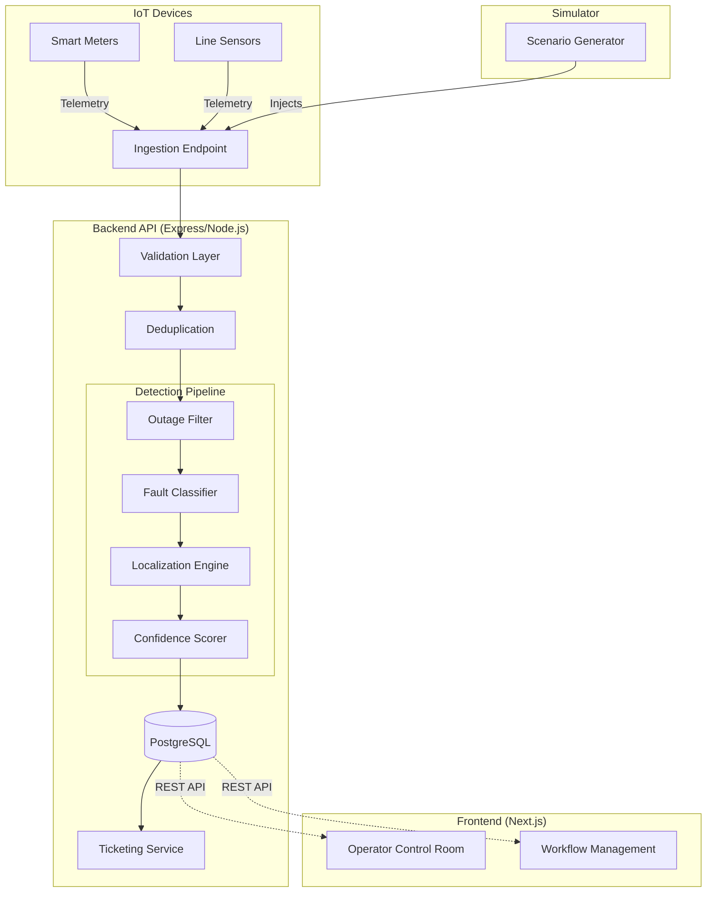

# System Architecture

## 🏗 Architecture Diagram

## 📡 Telemetry Ingestion Flow
The ingestion flow is optimized for noisy IoT environments. Incoming POST requests to `/api/v1/telemetry` pass through:
1. **Validation:** Checks payload shape and required fields.
2. **Deduplication:** Uses PostgreSQL unique constraints and upsert logic to discard redundant events sent by stuttering devices.
3. **Outage Filter:** Queries the `scheduled_outages` table. If the device falls within an active maintenance window, the event is logged but suppressed from anomaly detection.

## 🧠 Detection Pipeline
The detection pipeline is implemented as pure, deterministic TypeScript functions (`src/algorithms/`), isolated from database side-effects for testability.

### 1. Fault Classifier
Classifies the nature of the event based on topological signatures rather than AI/ML:
- **Device Failure:** Single device offline, neighbors alive.
- **Transformer Fault:** All devices on a transformer offline simultaneously.
- **Span Fault:** A sequence of contiguous poles on a feeder branch offline.
- **Feeder Fault:** Entire feeder offline.

### 2. Localization Algorithm
Determines the physical coordinate of the fault.
- **Exact Localization:** If the topology is known, it traverses the connected graph to pinpoint the exact pole or transformer immediately upstream of the outage.
- **Estimated Localization:** If topology is missing or corrupted, it calculates the geographic centroid of the affected devices and uses the highest common logical denominator (e.g., feeder code) as the boundary.

### 3. Confidence Calculation
Calculates a score between `0.0` and `1.0`.
- **Topological agreement:** +0.4 if exact topology exists.
- **Neighbor correlation:** +0.4 if neighboring devices corroborate the outage.
- **Time proximity:** +0.2 if events arrived within a tight temporal window.

## 🛡️ Edge Case Handling
- **Duplicate Messages:** Prevented at the database level using constraints on `(device_id, event_type, recorded_at)`.
- **Late Messages:** Handled gracefully. The `recorded_at` timestamp is trusted over the `received_at` timestamp for pipeline orchestration.
- **Dead Sensors:** The pipeline treats silent devices as "state unchanged". If a sensor dies without sending a `power_lost` event, downstream algorithms degrade confidence but do not crash.
- **Scheduled Outages:** Hard-filtered before reaching the detection pipeline.
- **Missing Topology:** The localization engine falls back to bounding-box estimations, preserving operations even with incomplete GIS data.

## 🗄️ Database Design
The application uses raw parameterized SQL via the `pg` driver, completely avoiding ORMs for maximum query performance and explicit constraint enforcement.
- `devices`, `poles`, `transformers`, `feeders`: Hierarchical topology.
- `telemetry_events`: High-volume append-heavy table.
- `incidents`: High-value anomaly records.
- `tickets`: Workflow management.

## 🔌 API Summary

| Method | Endpoint | Description |
|--------|----------|-------------|
| POST | `/api/v1/telemetry` | Ingest raw IoT data |
| GET | `/api/v1/dashboard` | Aggregate statistics for UI |
| GET | `/api/v1/incidents` | List all anomalies |
| GET | `/api/v1/incidents/:id` | Full forensic detail of an incident |
| GET | `/api/v1/tickets` | Operator workflow queue |
| PATCH | `/api/v1/tickets/:id` | Transition workflow states |
| POST | `/api/v1/simulator/:scenario` | Inject deterministic fault simulations |

## 🖥️ Frontend Architecture
Built with Next.js App Router and React Query. 
- Designed as a "Control Room" (Dark mode, high information density).
- Uses `refetchInterval` in React Query for near-real-time polling without WebSocket overhead.
- State is entirely derived from the backend; no complex client-side reducers.
- Leaflet map isolates itself from React's SSR using `next/dynamic`.

## 🧪 Simulator Architecture
Located in `src/simulator/`, the simulator bypasses the HTTP layer and directly invokes the internal telemetry services. It can generate 6 deterministic scenarios (e.g., Span Fault, Restorations) mapping directly to pipeline capabilities.

## 📈 Known Limitations & Scalability
- **Database Writes:** The current PostgreSQL setup inserts telemetry synchronously. Under massive load (e.g., 100k events/sec during a massive blackout), the DB connection pool will bottleneck.
- **Polling Overhead:** The frontend uses HTTP polling. At scale with hundreds of concurrent operators, this will strain the Express server.
- **Correlated Subqueries:** The dashboard devices query uses a correlated subquery for real-time status. As `telemetry_events` grows into the millions, this query will degrade without materialized views.

## 🚀 Future Improvements
- **Message Queue:** Introduce Kafka/RabbitMQ in front of the ingestion endpoint to buffer telemetry spikes.
- **WebSockets:** Replace HTTP polling with Socket.io for live dashboard updates.
- **TimescaleDB:** Migrate the `telemetry_events` table to TimescaleDB (a Postgres extension) for hyper-optimized time-series querying and auto-partitioning.
