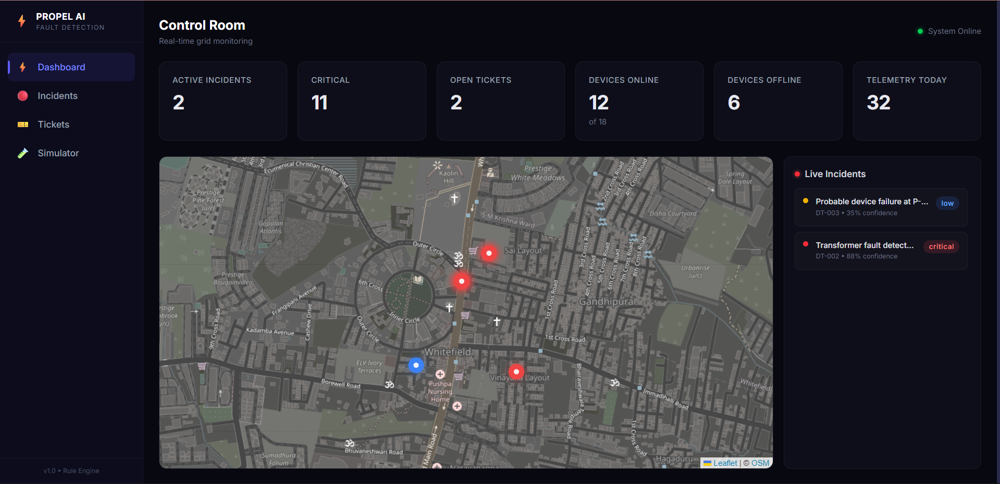
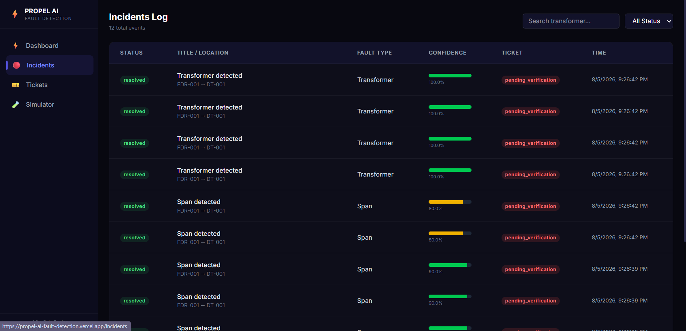
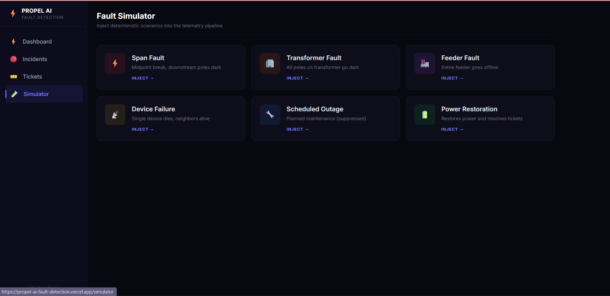
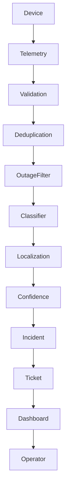

# ⚡ Propel AI — Intelligent Fault Detection System

An end-to-end AI-assisted fault detection platform for electrical distribution networks. The system ingests smart grid telemetry, filters noisy events, localizes faults (even with incomplete topology), generates incidents and tickets, and provides operators with a real-time control room dashboard.

---

## 🚀 Live Demo

### 🌐 Frontend
https://propel-ai-fault-detection.vercel.app/

### ⚙️ Backend API
https://propel-ai-fault-detection.onrender.com

### ❤️ Health Check
https://propel-ai-fault-detection.onrender.com/api/v1/health

### 🎥 Demo Video
<https://drive.google.com/drive/folders/1IKvJqakHglnE3606jKiX9qBUOT7iDFzH?lfhs=2>

---

## 📸 Screenshots

### Dashboard



### Incident Details



### Fault Simulator



---

# 📌 Problem Statement

Modern electricity distribution networks generate continuous telemetry from smart monitoring devices. While this enables faster outage detection, it also introduces significant challenges:

- Noisy and duplicate telemetry
- Missing topology information
- Scheduled maintenance causing false alarms
- Difficulty distinguishing device failures from actual grid faults
- Slow operator response due to poor visualization

The objective of this project is to automatically analyze telemetry, accurately localize outages, suppress false positives, and provide operators with actionable information.

---

# 💡 Solution Overview

The Propel AI Fault Detection System processes telemetry through a deterministic detection pipeline.

- Validates incoming telemetry
- Removes duplicate events
- Filters scheduled maintenance
- Classifies fault type
- Localizes probable fault location
- Calculates confidence score
- Creates incidents and tickets
- Visualizes everything in a real-time dashboard

Unlike black-box AI systems, every decision is explainable and reproducible.

---

# ✨ Features

| Feature | Status |
|----------|--------|
| Real-time Telemetry Ingestion | ✅ |
| Duplicate Detection | ✅ |
| Scheduled Outage Suppression | ✅ |
| Span Fault Detection | ✅ |
| Transformer Fault Detection | ✅ |
| Feeder Fault Detection | ✅ |
| Device Failure Detection | ✅ |
| Fault Localization | ✅ |
| Confidence Scoring | ✅ |
| Incident Management | ✅ |
| Ticket Workflow | ✅ |
| Interactive Dashboard | ✅ |
| Fault Simulator | ✅ |
| Docker Deployment | ✅ |

---

# ⚙️ Detection Pipeline

```text
Telemetry Device
        │
        ▼
POST /telemetry
        │
        ▼
Payload Validation
        │
        ▼
Duplicate Detection
        │
        ▼
Scheduled Outage Filter
        │
        ▼
Fault Classification
        │
        ▼
Fault Localization
        │
        ▼
Confidence Scoring
        │
        ▼
Incident Creation
        │
        ▼
Ticket Creation
        │
        ▼
Operator Dashboard
```

---

# 🧠 Supported Fault Types

- ✅ Span Fault
- ✅ Transformer Fault
- ✅ Feeder Fault
- ✅ Device Failure
- ✅ Scheduled Outage
- ✅ Power Restoration

---

# 🏗️ System Architecture



---

# 🛠️ Tech Stack

## Backend

- Node.js
- Express.js
- TypeScript
- PostgreSQL
- Raw SQL (No ORM)
- Docker

## Frontend

- Next.js 16
- React
- TypeScript
- Tailwind CSS
- React Query
- React Leaflet
- Framer Motion

## Database

- PostgreSQL
- Indexed relational schema
- Constraints
- Seed data
- Incident & telemetry history

---

# 📂 Project Structure

```text
.
├── backend
│   ├── database
│   ├── src
│   │   ├── algorithms
│   │   ├── controllers
│   │   ├── database
│   │   ├── services
│   │   ├── simulator
│   │   ├── routes
│   │   └── types
│   └── Dockerfile
│
├── frontend
│   ├── src
│   │   ├── app
│   │   ├── components
│   │   ├── lib
│   │   └── types
│   └── Dockerfile
│
├── docker-compose.yml
├── README.md
├── ARCHITECTURE.md
├── DEPLOYMENT.md
├── DECISIONS.md
└── AI-WORKFLOW.md
```

---

# 🚀 Running Locally

Clone the repository.

```bash
git clone https://github.com/Ganpatsingh05/propel-ai-fault-detection.git

cd propel-ai-fault-detection
```

Start the complete production stack.

```bash
docker compose up --build
```

This automatically starts:

- PostgreSQL Database
- Express Backend
- Next.js Frontend

No additional setup is required.

---

# 🌍 Deployment

## Frontend

Hosted on Vercel.

https://propel-ai-fault-detection.vercel.app/

## Backend

Hosted on Render.

https://propel-ai-fault-detection.onrender.com

---

# 📡 REST API

| Method | Endpoint | Description |
|---------|----------|-------------|
| GET | /api/v1/health | Health Check |
| POST | /api/v1/telemetry | Process Telemetry |
| GET | /api/v1/dashboard | Dashboard Statistics |
| GET | /api/v1/incidents | Incident List |
| GET | /api/v1/incidents/:id | Incident Details |
| GET | /api/v1/tickets | Ticket Queue |
| PATCH | /api/v1/tickets/:id | Update Ticket Workflow |
| POST | /api/v1/simulator/span | Simulate Span Fault |
| POST | /api/v1/simulator/transformer | Simulate Transformer Fault |
| POST | /api/v1/simulator/feeder | Simulate Feeder Fault |
| POST | /api/v1/simulator/device | Simulate Device Failure |
| POST | /api/v1/simulator/outage | Simulate Scheduled Outage |
| POST | /api/v1/simulator/restore | Simulate Power Restoration |

---

# 📊 Key Design Decisions

- Deterministic fault localization instead of LLM-based reasoning
- Raw SQL instead of an ORM for complete query control
- Layered architecture (Controllers → Services → Repositories)
- Pure functional detection algorithms
- Confidence scoring based on transparent rules
- Fault simulator built using the production telemetry pipeline
- Explainable incident generation through stored detection results

---

# 📚 Documentation

Detailed documentation is included in the repository.

- 📘 ARCHITECTURE.md
- 🚀 DEPLOYMENT.md
- ⚖️ DECISIONS.md
- 🤖 AI-WORKFLOW.md

---

# 👨‍💻 Developed For

**Propel AI Product Engineer Assignment (2026)**

This repository was developed as part of the Propel AI hiring assignment, demonstrating fault localization, telemetry processing, incident management, product thinking, and full-stack engineering.

---

## ⭐ If you found this project interesting, feel free to star the repository.